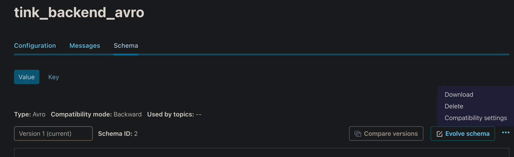
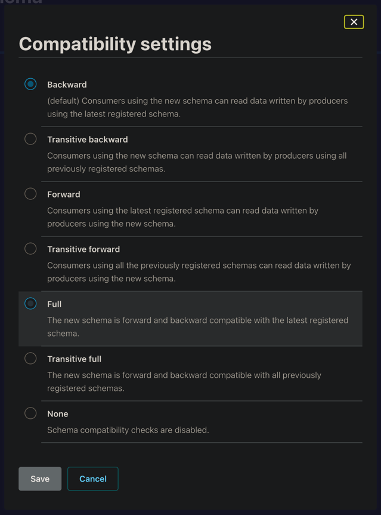

[Вернуться][main]

---

# Формат AVRO

## Цели

- Изучить формат AVRO при работе со Schema Registry.

## Еще раз о том, что такое реестр схем Kafka и чем он полезен

Реестр схем (Schema Registry) – это модуль Confluent для Apache Kafka, который позволяет централизовано управлять
схемами данных полезной нагрузки сообщений в топиках. Приложения-продюсеры и потребители Kafka могут использовать эти
схемы для обеспечения согласованности и совместимости данных по мере их эволюционного развития. Можно сказать, что
реестр схем — это ключевой компонент управления данными в потоковой системе, помогающий обеспечить их качество,
соблюдение стандартов и прозрачность происхождения с поддержкой аудита и совместной работы между разными командами.
Определив схемы данных для полезной нагрузки и зарегистрировав её в реестре, её можно переиспользовать, частично
освобождая приложение-потребитель от валидации структуры данных. Когда продюсер отправляет события в Kafka, схема данных
включается в заголовок сообщения, а Schema Registry гарантирует валидность структуры данных для конкретного топика.

Таким образом, реестр схем позволяет продюсерам и потребителям взаимодействовать в рамках чётко определенного контракта
данных, контролируя эволюционное развитие схемы с помощью явных правил совместимости. Также это оптимизирует
полезную нагрузку по сети, передавая идентификатор схемы вместо всего определения схемы. Фактически реестр схемы состоит
из REST-сервиса для проверки, хранения и получения схем в форматах AVRO, JSON Schema и Protobuf. Сериализаторы и
десериализаторы этих 3-х форматов данных подключаются к клиентам Apache Kafka, т.е. приложениям-продюсерам и
потребителям для хранения и извлечения схем полезной нагрузки.

## Пример

Приложение-продюсер каждые 5 секунд публикует сообщения формата AVRO в топик Kafka под названием test_avro,
используя следующую схему для полезной нагрузки:

```json
{
  "type": "record",
  "name": "application",
  "namespace": "com.tink",
  "fields": [
    {
      "name": "id",
      "type": "long"
    },
    {
      "name": "event_time",
      "type": "string"
    },
    {
      "name": "client",
      "type": "string"
    },
    {
      "name": "email",
      "type": "string"
    }
  ]
}
```

### Будем использовать библиотеку faker для генерации тестовых данных, fastavro для взаимодействия с AVRO

```sh
pip install faker
pip install fastavro
```

### Инициализируем отдельного продюсера для работы с AVRO - [producer_avro.py][producer_avro]

### Добавим необходимые импорты:

```py
from time import sleep, time, strftime, localtime

from faker import Faker

from confluent_kafka import Producer
from confluent_kafka.serialization import SerializationContext, MessageField
from confluent_kafka.schema_registry import SchemaRegistryClient
from confluent_kafka.schema_registry.avro import AvroSerializer

from kafka_utils import KAFKA_CONFIG, SR_CONFIG, AVRO_TOPIC
```

### Определим схему данных

```py
avro_schema = """{
  "type": "record",
  "name": "application",
  "namespace": "com.tink",
  "fields": [
    {
      "name": "id",
      "type": "long"
    },
    {
      "name": "event_time",
      "type": "string"
    },
    {
      "name": "client",
      "type": "string"
    },
    {
      "name": "email",
      "type": "string"
    }
  ]
}
"""
```

### инициализируем объект фейкера

```py
fake = Faker('ru_RU')
```

### Обогатим блок main кодом для записи данных:

```py
if __name__ == '__main__':
    # Создается экземпляр SchemaRegistryClient
    schema_registry_client = SchemaRegistryClient(SR_CONFIG)
    # Создается экземпляр JSONSerializer
    avro_serializer = AvroSerializer(
        schema_registry_client,
        avro_schema,
    )
    # Создается экземпляр Producer
    producer = Producer(KAFKA_CONFIG)

    id_ = 0
    # Бесконечный цикл публикации данных.
    while True:
        start_time = time()
        id_ += 1
        producer_publish_time = strftime("%m/%d/%Y %H:%M:%S", localtime(start_time))
        application = {
            "id": id_,
            "event_time": producer_publish_time,
            "client": fake.name(),
            "email": fake.free_email()
        }
        value = avro_serializer(application, SerializationContext(AVRO_TOPIC, MessageField.VALUE))
        future = producer.produce(topic=AVRO_TOPIC, value=value)
        print("Message sent successfully")
        print(f' [x] Payload {application}')
        # Повтор через 5 секунды.
        sleep(5)
```

### Создание топика

> Важно отметить, что схема данных будет создана и зарегистрирована в реестре только при отсутствии ошибок, которые чаще
> всего связаны с использованием не поддерживаемого типа данных. Например, если попытаться использовать integer для поля
> id вместо long, получим сообщение об ошибке, т.к. в формате AVRO нет типа данных integer, в отличие от JSON.

## Правила совместимости

В UI можно выбрать правила совместимости:





- BACKWARD – потребители, использующие новую схему, могут читать данные, опубликованные продюсерами с использованием
  последней версии схемы, зарегистрированной в реестре;
- BACKWARD_TRANSITIVE – правило совместимости по умолчанию, когда потребители, использующие новую схему, могут читать
  данные, опубликованные продюсерами с использованием всех ранее зарегистрированных в реестре схем;
- FORWARD – потребители, использующие последнюю зарегистрированную схему, могут читать данные, опубликованные
  продюсерами, использующими новую версию схемы;
- FORWARD_TRANSITIVE – потребители, использующие все ранее зарегистрированные схемы, могут читать данные, опубликованные
  продюсерами с использованием новой схемы;
- FULL — новая версия схемы полностью совместима с последней зарегистрированной схемой;
- FULL_TRANSITIVE — новая версия схемы полностью совместима со всеми ранее зарегистрированными схемами;
- NONE — проверки совместимости схемы отключены.

При выборе TRANSITIVE-правил (BACKWARD_TRANSITIVE или FORWARD_TRANSITIVE) схема будет сравниваться со всеми предыдущими
версиями, а не только с последней.

---

[Вернуться][main]


[main]: ../../README.md "содержание"

[producer_avro]: ./src/producer_avro.py "producer_avro"

[consumer_avro]: ./src/consumer_avro.py "consumer_avro"