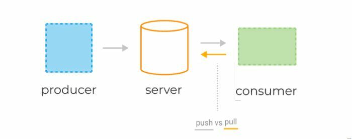
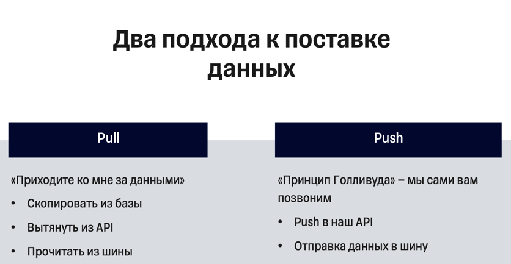
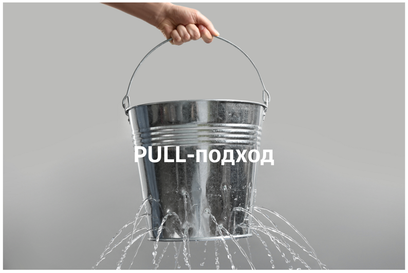
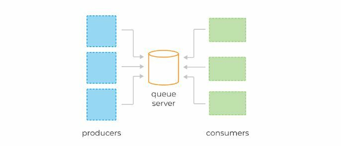
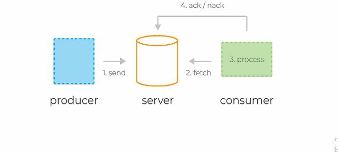
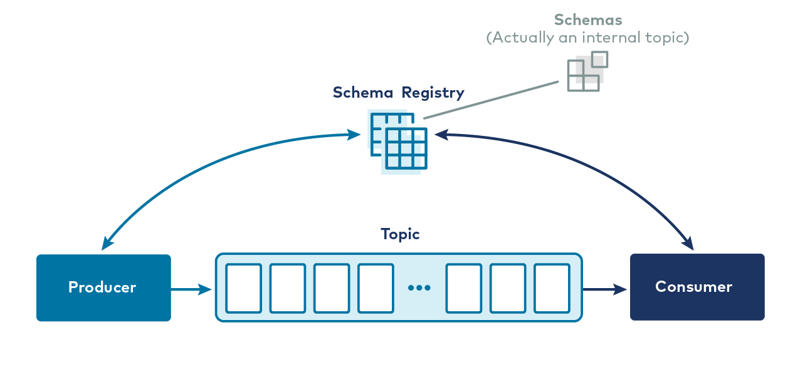
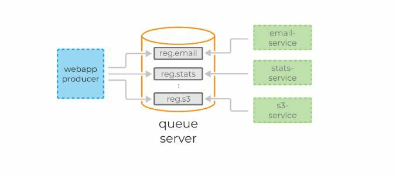
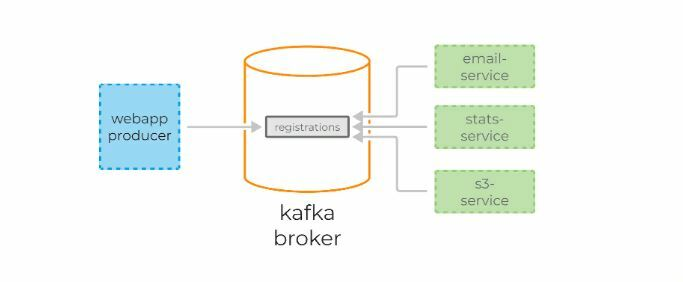

[Вернуться][main]

---

# Kafka и классические сервисы очередей

Для погружения в технологию сравним Kafka и классические сервисы очередей, такие как RabbitMQ и Amazon SQS.

Системы очередей обычно состоят из трёх базовых компонентов:

1) сервер,
2) продюсеры, которые отправляют сообщения в некую именованную очередь, заранее сконфигурированную администратором на
   сервере,
3) консюмеры, которые считывают те же самые сообщения по мере их появления.

## Базовые компоненты классической системы очередей

В веб-приложениях очереди часто используются для отложенной обработки событий или в качестве временного буфера между
другими сервисами, тем самым защищая их от всплесков нагрузки.

Консюмеры получают данные с сервера, используя две разные модели запросов: `pull` или `push`.

Pull-подход

**pull-модель** — консюмеры сами отправляют запрос раз в n секунд на сервер для получения новой порции сообщений. При
таком подходе клиенты могут эффективно контролировать собственную нагрузку. Кроме того, pull-модель позволяет
группировать сообщения в батчи, таким образом достигая лучшей пропускной способности. К минусам модели можно отнести
потенциальную разбалансированность нагрузки между разными консюмерами, а также более высокую задержку обработки данных.

**push-модель** — сервер делает запрос к клиенту, посылая ему новую порцию данных. По такой модели, например, работает
RabbitMQ. Она снижает задержку обработки сообщений и позволяет эффективно балансировать распределение сообщений по
консюмерам. Но для предотвращения перегрузки консюмеров в случае с RabbitMQ клиентам приходится использовать
функционал QS, выставляя лимиты.

Как правило, приложение пишет и читает из очереди с помощью нескольких инстансов продюсеров и консюмеров. Это позволяет
эффективно распределить нагрузку.

### Типичный жизненный цикл сообщений в системах очередей:

1. Продюсер отправляет сообщение на сервер.
2. Консюмер фетчит (от англ. fetch — принести) сообщение и его уникальный идентификатор сервера.
3. Сервер помечает сообщение как in-flight. Сообщения в таком состоянии всё ещё хранятся на сервере, но временно не
   доставляются другим консюмерам. Таймаут этого состояния контролируется специальной настройкой.
4. Консюмер обрабатывает сообщение, следуя бизнес-логике. Затем отправляет ack или nack-запрос обратно на сервер,
   используя уникальный идентификатор, полученный ранее — тем самым либо подтверждая успешную обработку сообщения, либо
   сигнализируя об ошибке.
5. В случае успеха сообщение удаляется с сервера навсегда. В случае ошибки или таймаута состояния in-flight сообщение
   доставляется консюмеру для повторной обработки.

С базовыми принципами работы очередей разобрались, теперь перейдём к Kafka. Рассмотрим её фундаментальные отличия.

Как и сервисы обработки очередей, Kafka условно состоит из трёх компонентов:

1) сервер (по-другому ещё называется брокер),
2) продюсеры — они отправляют сообщения брокеру,
3) консюмеры — считывают эти сообщения, используя модель pull.

### Базовые компоненты Kafka

Пожалуй, фундаментальное отличие Kafka от очередей состоит в том, как сообщения хранятся на брокере и как потребляются
консюмерами.

- Сообщения в Kafka не удаляются брокерами по мере их обработки консюмерами — данные в Kafka могут храниться днями,
  неделями, годами.
- Благодаря этому одно и то же сообщение может быть обработано сколько угодно раз разными консюмерами и в разных
  контекстах.

В этом кроется главная мощь и главное отличие Kafka от традиционных систем обмена сообщениями.

Теперь давайте посмотрим, как Kafka и системы очередей решают одну и ту же задачу. Начнём с системы очередей.

Представим, что есть некий сайт, на котором происходит регистрация пользователя. Для каждой регистрации мы должны:

1) отправить письмо пользователю,
2) пересчитать дневную статистику регистраций.

В случае с RabbitMQ или Amazon SQS функционал может помочь нам доставить сообщения всем сервисам одновременно. Но при
необходимости подключения нового сервиса придётся конфигурировать новую очередь.

Kafka упрощает задачу. Достаточно послать сообщения всего один раз, а консюмеры сервиса отправки сообщений и консюмеры
статистики сами считают его по мере необходимости.

Kafka также позволяет тривиально подключать новые сервисы к стриму регистрации. Например, сервис архивирования всех
регистраций в S3 для последующей обработки с помощью Spark или Redshift можно добавить без дополнительного
конфигурирования сервера или создания дополнительных очередей.

Кроме того, раз Kafka не удаляет данные после обработки консюмерами, эти данные могут обрабатываться заново, как бы
отматывая время назад сколько угодно раз. Это оказывается невероятно полезно для восстановления после сбоев и, например,
верификации кода новых консюмеров. В случае с RabbitMQ пришлось бы записывать все данные заново, при этом, скорее
всего, в отдельную очередь, чтобы не сломать уже имеющихся клиентов.

---

[Вернуться][main]

[main]: ../../README.md "содержание"

[python kafka-client]: https://docs.confluent.io/kafka-clients/python/current/overview.html "python kafka-client"