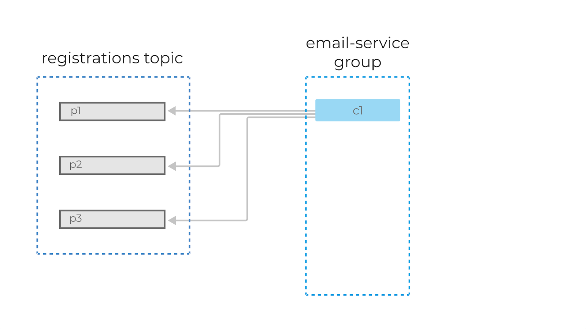
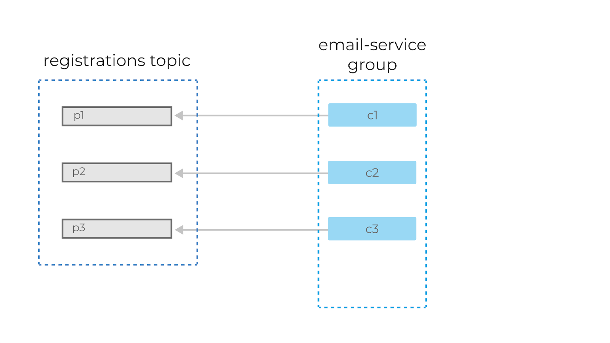
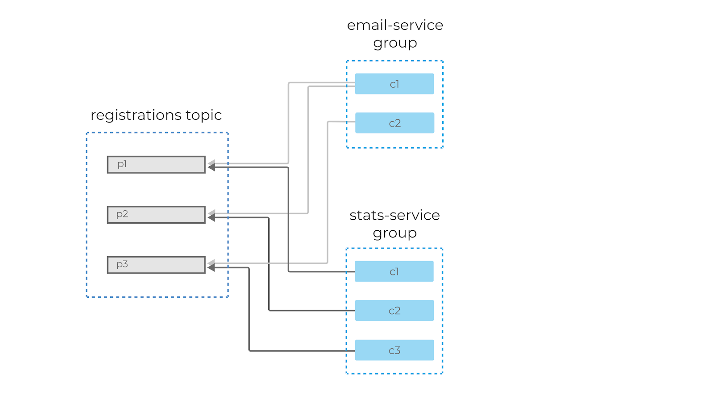
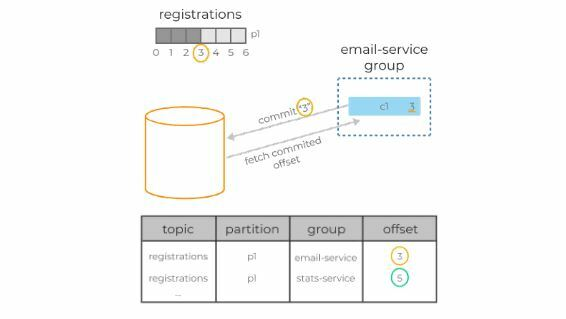

[Вернуться][main]

---

# Группы консюмеров

Теперь давайте перейдём к консюмерам и рассмотрим их принципы работы в Kafka. Каждый консюмер Kafka обычно является
частью какой-нибудь консюмер-группы.

Каждая группа имеет уникальное название и регистрируется брокерами в кластере Kafka. Данные из одного и того же топика
могут считываться множеством консюмер-групп одновременно. Когда несколько консюмеров читают данные из Kafka и являются
членами одной и той же группы, то каждый из них получает сообщения из разных партиций топика, таким образом распределяя
нагрузку.

Вернёмся к нашему примеру с топиком сервиса регистрации и представим, что у сервиса отправки писем есть своя собственная
консюмер-группа с одним консюмером `c1` внутри. Значит, этот консюмер будет получать сообщения из всех партиций
топика.

Если мы добавим ещё одного консюмера в группу, то партиции автоматически распределятся между ними, и `c1` теперь будет
читать сообщения из первой и второй партиции, а `c2` — из третьей. Добавив ещё одного консюмера (`c3`), мы добьёмся
идеального распределения нагрузки, и каждый из консюмеров в этой группе будет читать данные из одной партиции.

А вот если мы добавим в группу ещё одного консюмера (`c4`), то он не будет задействован в обработке сообщений вообще.

Важно понять: внутри одной консюмер-группы партиции назначаются консюмерам уникально, чтобы избежать повторной
обработки.

Если консюмеры не справляются с текущим объёмом данных, то следует добавить новую партицию в топик. Только после этого
консюмер c4 начнёт свою работу.

Механизм партиционирования является нашим основным инструментом масштабирования Kafka. Группы являются инструментом
отказоустойчивости.
Кстати, как вы думаете, что будет, если один из консюмеров в группе упадёт? Совершенно верно: партиции автоматически
распределятся между оставшимися консюмерами в этой группе.

Добавлять партиции в Kafka можно на лету, без перезапуска клиентов или брокеров. Клиенты автоматически обнаружат новую
партицию благодаря встроенному механизму обновления метаданных. Однако, нужно помнить две важные вещи:

1. Гарантия очерёдности данных — если вы пишете сообщения с ключами и хешируете номер партиции для сообщений, исходя из
   общего числа, то при добавлении новой партиции вы можете просто сломать порядок этой записи.
2. Партиции невозможно удалить после их создания, можно удалить только весь топик целиком.

И ещё неочевидный момент: если вы добавляете новую партицию на проде, то есть в тот момент, когда в топик пишут
сообщения продюсеры, то важно помнить про настройку `auto.offset.reset=earliest` в консюмере, иначе у вас есть шанс
потерять или просто не обработать кусок данных, записавшихся в новую партицию до того, как консюмеры обновили
метаданные по топику и начали читать данные из этой партиции.

Помимо этого, механизм групп позволяет иметь несколько несвязанных между собой приложений, обрабатывающих сообщения.

Как мы обсуждали ранее, можно добавить новую группу консюмеров к тому же самому топику, например, для обработки и
статистики регистраций. Эти две группы будут читать одни и те же сообщения из топика тех самых ивентов регистраций — в
своём темпе, со своей внутренней логикой.

А теперь, зная внутреннее устройство консюмеров в Kafka, давайте вернёмся к изначальному вопросу:

> **«Каким образом мы можем обозначить сообщения в партиции, как обработанные?».**

Для этого Kafka предоставляет механизм консюмер-офсетов. Как мы помним, каждое сообщение партиции имеет свой
собственный, уникальный, монотонно возрастающий офсет. Именно этот офсет и используется консюмерами для сохранения
партиций.

Консюмер делает специальный запрос к брокеру, так называемый offset-commit с указанием своей группы, идентификатора
топик-партиции и, собственно, офсета, который должен быть отмечен как обработанный. Брокер сохраняет эту информацию в
своём собственном специальном топике. При рестарте консюмер запрашивает у сервера последний закоммиченный офсет для
нужной топик-партиции, и просто продолжает чтение сообщений с этой позиции.

В примере консюмер в группе email-service-group, читающий партицию p1 в топике registrations, успешно обработал три
сообщения с офсетами 0, 1 и 2. Для сохранения позиций консюмер делает запрос к брокеру, коммитя офсет 3. В случае
рестарта консюмер запросит свою последнюю закоммиченную позицию у брокера и получит в ответе 3. После чего начнёт
читать данные с этого офсета.

Консюмеры вольны коммитить совершенно любой офсет (валидный, который действительно существует в этой топик-партиции) и
могут начинать читать данные с любого офсета, двигаясь вперёд и назад во времени, пропуская участки лога или обрабатывая
их заново.

Ключевой для понимания факт: в момент времени может быть только один закоммиченный офсет для топик-партиции в
консюмер-группе. Иными словами, мы не можем закоммитить несколько офсетов для одной и той же топик-партиции, эмулируя
каким-то образом выборочный acknowledgment (как это делалось в системах очередей).

Представим, что обработка сообщения с офсетом 1 завершилась с ошибкой. Однако мы продолжили выполнение нашей программы в
консюмере и запроцессили сообщение с офсетом 2 успешно. В таком случае перед нами будет стоять выбор: какой офсет
закоммитить — 1 или 3. В настоящей системе мы бы рекомендовали закоммитить офсет 3, добавив при этом функционал,
отправляющий ошибочное сообщение в отдельный топик для повторной обработки (ручной или автоматической). Подобные
алгоритмы называются Dead letter queue.

Разумеется, консюмеры, находящиеся в разных группах, могут иметь совершенно разные закоммиченные офсеты для одной и той
же топик-партиции.

---

[Вернуться][main]

[main]: ../../README.md "содержание"

[python kafka-client]: https://docs.confluent.io/kafka-clients/python/current/overview.html "python kafka-client"