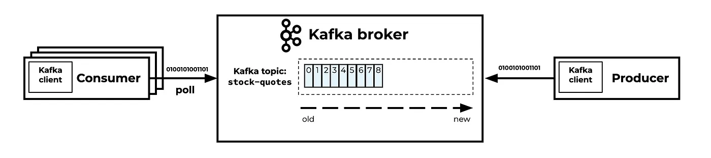
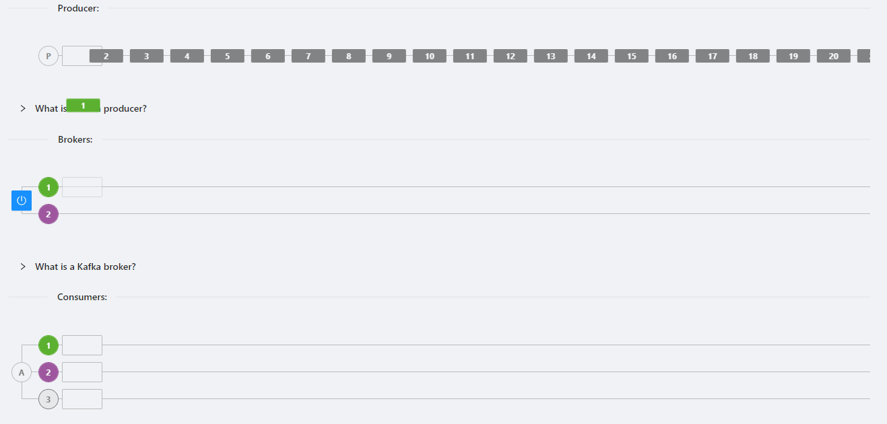
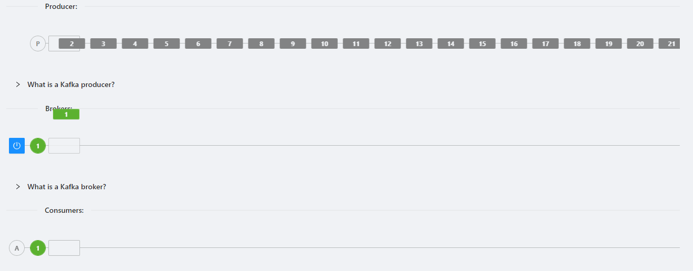

[Вернуться][main]

---

# Создание Консюмера

В системе Apache Kafka участвуют три основных компонента:

- производители (Producers)
- брокеры (Brokers)
- потребители (Consumers)

**Брокеры (Brokers)**

Брокеры являются промежуточной системой отвечающей за хранение и синхронизацию данных. Они отвечают за прием данных от
производителей, их хранение и перенаправление этих данных потребителям.

**Потребители (Consumers)**

Потребители читают этот поток данных из топиков Kafka. Группа потребителей может читать данные параллельно - каждый
потребитель в группе будет читать из уникальной партиции топика.

Важно отметить, что Kafka обеспечивает "атласную семантику" при потреблении данных - уникальный "офсет" для каждого
сообщения в партиции топика позволяет Kafka "помнить" какие сообщения были уже прочитаны, и при восстановлении после
сбоя потребители могут продолжить чтение с того места, где они остановились в последний раз.



## Пример консюмера

```py
from confluent_kafka import Consumer, KafkaError

# Настройки для Consumer  
c = Consumer({
    'bootstrap.servers': 'localhost:9092',
    'group.id': 'mygroup',
    'auto.offset.reset': 'earliest'
})

c.subscribe(['test_topic'])

# Потребление сообщений  
while True:
    msg = c.poll(1.0)

    if msg is None:
        continue
    if msg.error():
        if msg.error().code() == KafkaError._PARTITION_EOF:
            # Достигнут конец партиции  
            continue
        else:
            print(msg.error())
            break

    print('Received message: {}'.format(msg.value().decode('utf-8')))

c.close()  
```

## Группа консюмеров

Каждый консюмер Kafka входит в группу консюмеров. Одна и та же группа консюмеров позволяет нескольким
консюмерам читать из одного топика, разделяя данные между ними. Когда несколько консюмеров подписаны на топик и
принадлежат к одной группе консюмеров, каждый консюмер в группе будет получать сообщения из разных подмножеств
разделов топика.



В случае, когда в одной группе консюмеров больше консюмеров, чем разделов в топике, некоторые из консюмеров будут
простаивать и не получать сообщений вообще.

## Упорядочивание сообщений в топике Kafka

В топике Kafka с одним разделом порядок может быть гарантирован. На стороне продюсера все сообщения, которые были
отправлены с одним порядком, будут записаны в раздел. На стороне консюмера они будут прочитаны в том же порядке. Это
просто. Наглядный пример:



Но ситуация может меняться для топика с несколькими разделами.

Существует несколько методов:

- **Метод Round Robin** (по умолчанию) - когда сообщения будут отправляться в разные разделы, гарантируя, что перегрузка
  не произойдет на одном из разделов.
- **Hashing Key Partition** - во время создания сообщения в записи указываем один и тот же ключ для группы сообщений.
  Это гарантирует, что все они попадут в один и тот же раздел.
- **Custom Partitioner** - предоставление собственного механизма для отправки данных в указанный раздел.

---

[Вернуться][main]


[main]: ../../README.md "содержание"

[python kafka-client]: https://docs.confluent.io/kafka-clients/python/current/overview.html "python kafka-client"