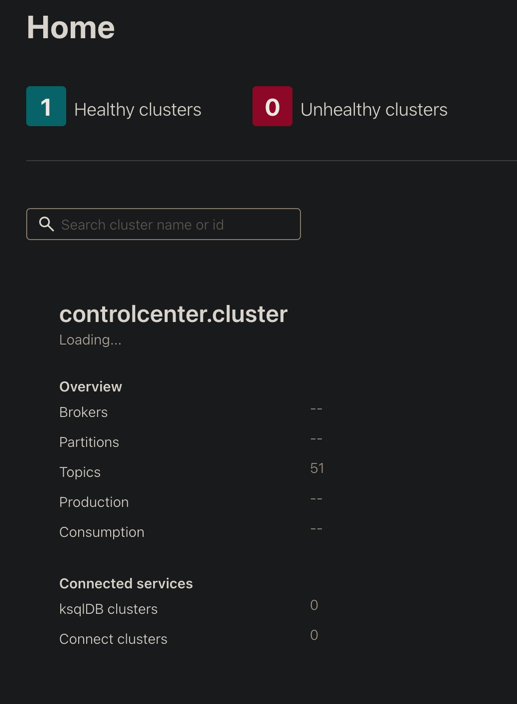
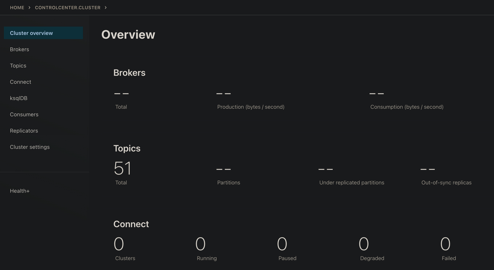
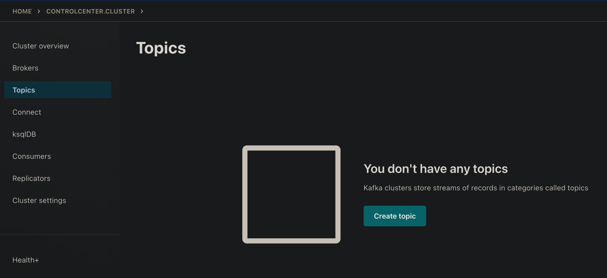
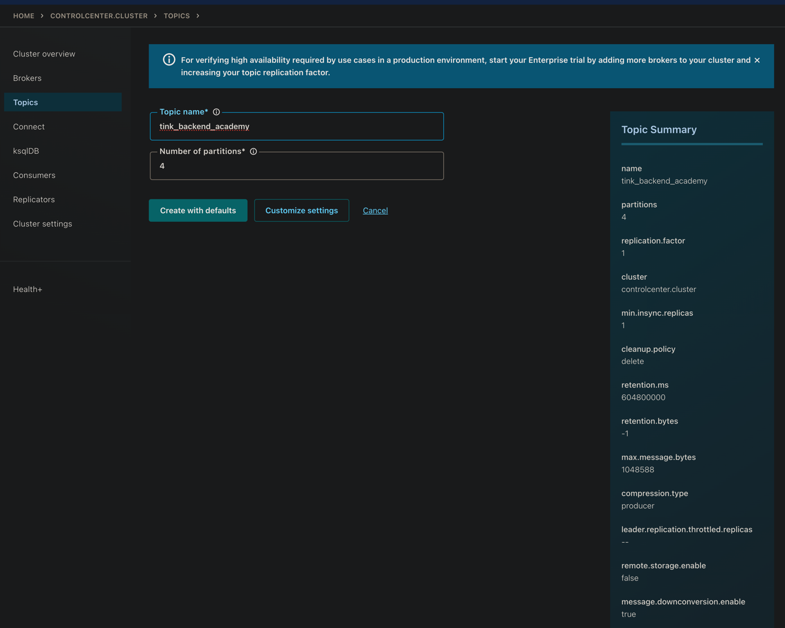
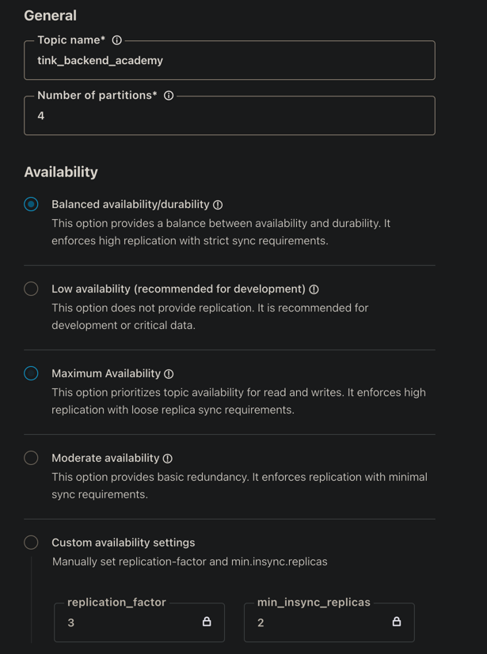
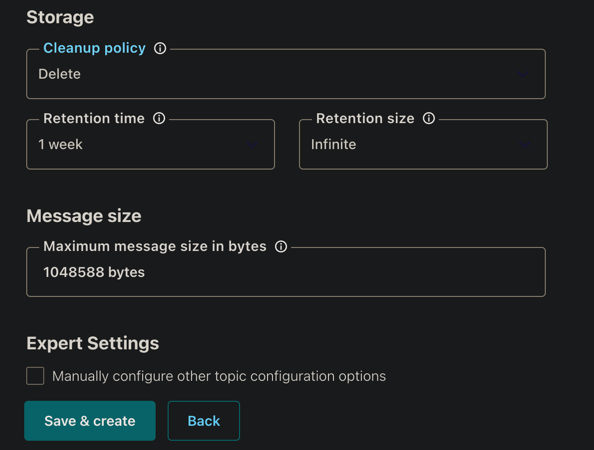
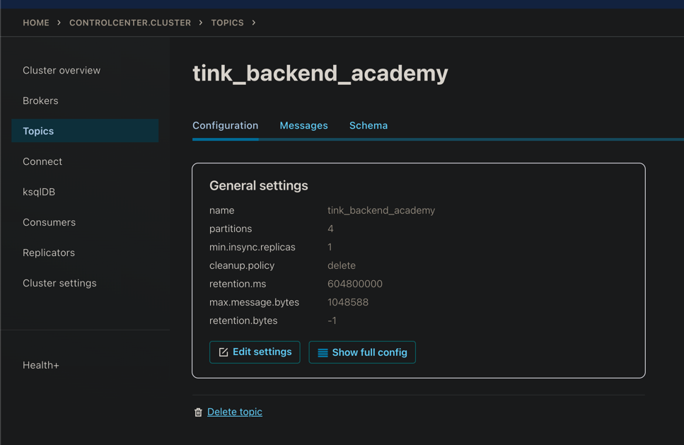

[Вернуться][main]

---

# Создание топика

## control-center

После поднятия локальной инфраструктуры можно редактировать топики в UI control-center:

[http://localhost:9021](http://localhost:9021)

[http://localhost:9021/clusters/.../overview](http://localhost:9021/clusters/.../overview)

[http://localhost:9021/clusters/.../management/topics](http://localhost:9021/clusters/.../management/topics)

[http://localhost:9021/clusters/.../management/create-topic](http://localhost:9021/clusters/.../management/create-topic)

Кастомизация:

Созданный топик:

---

[Вернуться][main]

[main]: ../../README.md "содержание"
