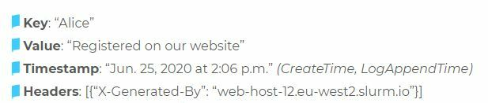
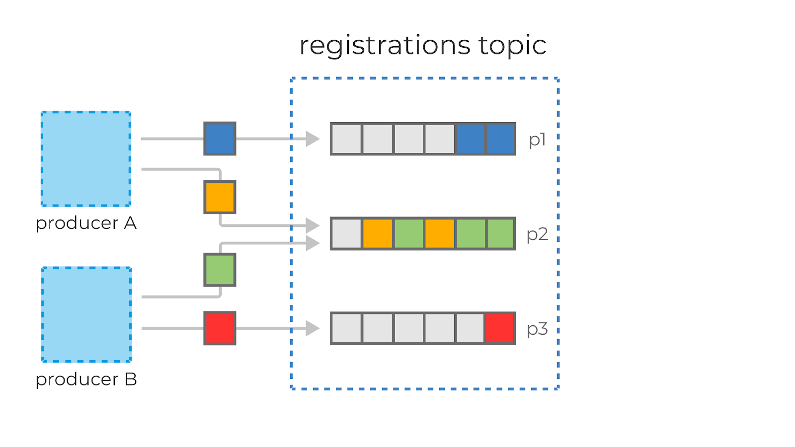
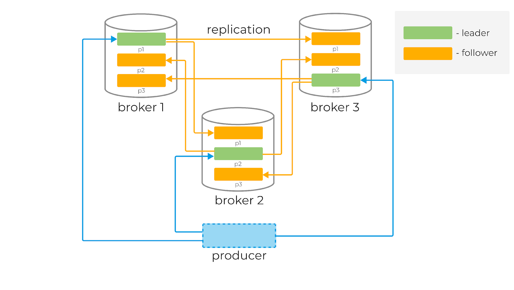
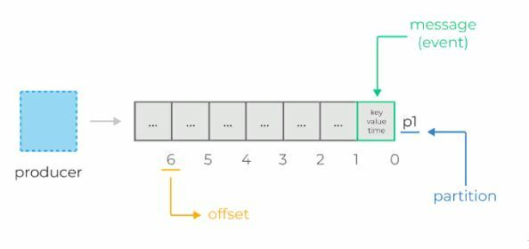

[Вернуться][main]

---

# Структура данных

Наверняка возникает вопрос: «Раз сообщения не удаляются, то как тогда гарантировать, что консюмер не будет читать одни
и те же сообщения (например, при перезапуске)?».

Для ответа на этот вопрос разберёмся, какова внутренняя структура Kafka и как в ней хранятся сообщения.

Каждое сообщение (event или message) в Kafka состоит из ключа, значения, таймстампа и опционального набора метаданных (
так называемых хедеров).

Например:

Сообщения в Kafka организованы и хранятся в именованных топиках (Topics), каждый топик состоит из одной и более
партиций (Partition), распределённых между брокерами внутри одного кластера. Подобная распределённость важна для
горизонтального масштабирования кластера, так как она позволяет клиентам писать и читать сообщения с нескольких брокеров
одновременно.

Когда новое сообщение добавляется в топик, на самом деле оно записывается в одну из партиций этого топика. Сообщения с
одинаковыми ключами всегда записываются в одну и ту же партицию, тем самым гарантируя очередность или порядок записи и
чтения.

Для гарантии сохранности данных каждая партиция в Kafka может быть реплицирована n раз, где n — replication factor.
Таким образом гарантируется наличие нескольких копий сообщения, хранящихся на разных брокерах.

У каждой партиции есть «лидер» (Leader) — брокер, который работает с клиентами. Именно лидер работает с продюсерами и в
общем случае отдаёт сообщения консюмерам. К лидеру осуществляют запросы фолловеры (Follower) — брокеры, которые хранят
реплику всех данных партиций. Сообщения всегда отправляются лидеру и, в общем случае, читаются с лидера.

Чтобы понять, кто является лидером партиции, перед записью и чтением клиенты делают запрос метаданных от брокера. Причём
они могут подключаться к любому брокеру в кластере.

Основная структура данных в Kafka — это распределённый, реплицируемый лог. Каждая партиция — это и есть тот самый
реплицируемый лог, который хранится на диске. Каждое новое сообщение, отправленное продюсером в партицию, сохраняется в
«голову» этого лога и получает свой уникальный, монотонно возрастающий offset (64-битное число, которое назначается
самим брокером).

Как мы уже выяснили, сообщения не удаляются из лога после передачи консюмерам и могут быть вычитаны сколько угодно раз.

Время гарантированного хранения данных на брокере можно контролировать с помощью специальных настроек. Длительность
хранения сообщений при этом не влияет на общую производительность системы. Поэтому совершенно нормально хранить
сообщения в Kafka днями, неделями, месяцами или даже годами.

---

[Вернуться][main]

[main]: ../../README.md "содержание"

[python kafka-client]: https://docs.confluent.io/kafka-clients/python/current/overview.html "python kafka-client"