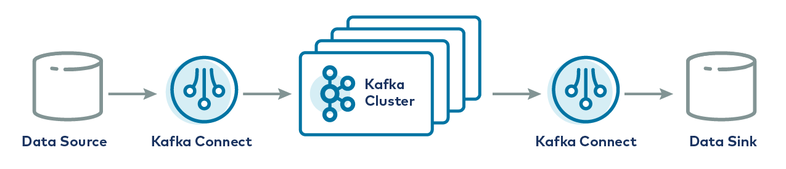
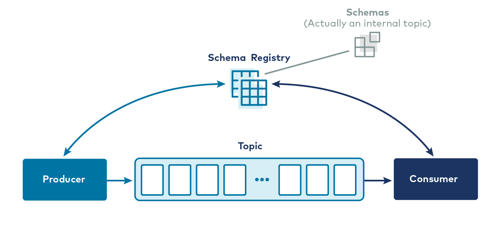

[Вернуться][main]

---

# Компоненты и экосистема

Если бы у вас были только брокеры, управляющие разделёнными, реплицируемыми топиками с постоянно растущей коллекцией
производителей и потребителей, пишущих и читающих события, у вас была бы довольно полезная система. Однако, по опыту
сообщества Kafka, появляются определенные шаблоны, которые побуждают вас и ваших коллег-разработчиков снова и снова
создавать одни и те же элементы функциональности вокруг ядра Kafka.

В итоге вы будете создавать общие слои функциональности приложения для повторения определенных недифференцированных
задач. Это код, который выполняет важную работу, но никак не связан с бизнесом, которым вы занимаетесь. Он не приносит
пользы непосредственно вашим клиентам. Это инфраструктура, и она должна предоставляться сообществом или поставщиком
инфраструктуры.

Может возникнуть соблазн написать этот код самостоятельно, но делать это не обязательно.

- `Kafka Connect`
- `Confluent Schema Registry`
- `Kafka Streams`
- `ksqlDB`

это примеры такого рода инфраструктурного кода. Немного подробностей о некоторых из них.

## Kafka Connect



В мире хранения и поиска информации некоторые системы не являются Kafka. Иногда вы хотите, чтобы данные из этих систем
попадали в топики Kafka, а иногда - чтобы данные из топиков Kafka попадали в эти системы.
Как интеграционный API Apache Kafka, именно это и делает `Kafka Connect.`

### Что делает Kafka Connect?

С одной стороны, `Kafka Connect` - это экосистема подключаемых коннекторов, а с другой - клиентское приложение. В
качестве
клиентского приложения Connect представляет собой серверный процесс, который работает на аппаратном обеспечении,
независимом от самих брокеров Kafka. Он масштабируемый и отказоустойчивый, то есть вы можете запустить не
один-единственный рабочий Connect, а кластер рабочих Connect, которые разделят нагрузку по перемещению данных в Kafka из
внешних систем и обратно. `Kafka Connect` также абстрагирует от пользователя работу с кодом и требует только
JSON-конфигурации для запуска. Например, вот так можно передавать данные из Kafka в Elasticsearch:

```json
{
  "connector.class": "io.confluent.connect.elasticsearch.ElasticsearchSinkConnector",
  "topics": "my_topic",
  "connection.url": "http://elasticsearch:9200",
  "type.name": "_doc",
  "key.ignore": "true",
  "schema.ignore": "true"
}
```

### Преимущества Kafka Connect

Одним из главных преимуществ Kafka Connect является его обширная экосистема коннекторов. Написание кода для перемещения
данных в облачное хранилище, записи в Elasticsearch или вставки записей в реляционную базу данных - это код, который
вряд ли будет меняться от одного бизнеса к другому. Аналогично, чтение из реляционной базы данных, Salesforce или
устаревшей файловой системы HDFS - это одна и та же операция, независимо от того, какое приложение ее выполняет. Вы,
безусловно, можете написать такой код, но трата времени на это не добавит вашим клиентам никакой уникальной ценности и
не сделает ваш бизнес более конкурентоспособным.

Все это - примеры коннекторов Kafka, доступных в [Confluent Hub][confluent_hub] - курируемой коллекции коннекторов
всех видов и, что самое важное, всех лицензий и уровней поддержки. Некоторые из них лицензированы на коммерческой
основе, а некоторые можно использовать бесплатно. Connect Hub позволяет искать коннекторы-источники и коннекторы-синки
всех видов и четко показывает лицензию каждого коннектора. Конечно, коннекторы не обязательно должны быть из Hub,
их можно найти на GitHub или в других местах на рынке. И если после всего этого вы все ещё не можете найти коннектор,
который делает то, что вам нужно, вы можете написать свой собственный, используя довольно простой API.

Может показаться, что создать подобную функциональность своими силами проще простого: Если внешняя система-источник
легко читается, то будет достаточно просто читать из нее и производить в конечную тему. Если внешняя система-синк
проста для записи, то опять же будет достаточно просто потреблять из топика и записывать в эту систему. Однако возникает
множество сложностей, включая то, как справиться с отказоустойчивостью, горизонтальным масштабированием, управлять
обычными операциями преобразования входящих и исходящих данных, распространять общий код коннектора, настраивать и
управлять им через стандартный интерфейс и многое другое.

На первый взгляд Connect кажется обманчиво простым, но на самом деле он представляет собой сложную распределенную
систему и экосистему плагинов в своем собственном понимании. И если в этой экосистеме плагинов нет того, что вам нужно,
фреймворк Connect с открытым исходным кодом позволяет легко создать свой собственный коннектор и унаследовать все
свойства масштабируемости и отказоустойчивости, которые предлагает Connect.

## Schema Registry



Когда приложения начнут активно отправлять сообщения в Kafka и получать их из неё, произойдут две вещи.

- Во-первых, появятся новые потребители существующих топиков. Это совершенно новые приложения - возможно, написанные
  командой, которая создала первоначального производителя сообщений, возможно, другой командой, - и они должны будут
  понимать формат сообщений в топике.
- Во-вторых, формат этих сообщений будет меняться по мере развития бизнеса. Объекты заказов получают
  новое поле статуса, имена пользователей разделяются на имя и фамилию, а не на полное имя, и так далее. Схема объектов
  нашего домена - это постоянно движущаяся цель, и мы должны иметь возможность согласовать схему сообщений в любом
  топике. Confluent Schema Registry существует для решения этой проблемы.

### Что такое реестр схем?

**Schema Registry** - это отдельный серверный процесс, который запускается на машине, внешней по отношению к брокерам
Kafka. Его задача - поддерживать базу данных всех схем, которые были записаны в топики в кластере, за который он
отвечает. Эта "база данных" хранится во внутреннем топике Kafka и кэшируется в **Schema Registry** для доступа с низкой
задержкой. **Schema Registry** может работать в избыточной конфигурации с высокой степенью доступности, так что при
выходе из строя одного экземпляра он остается работоспособным.

**Schema Registry** - это также API, позволяющий производителям и потребителям предсказывать, совместимо ли сообщение,
которое они собираются записать или прочитать, с предыдущими версиями. Когда производитель настроен на использование
**Schema Registry**, он вызывает API на конечной точке **Schema Registry REST** и представляет схему нового сообщения.
Если она такая же, как и у последнего созданного сообщения, то производство может быть успешным. Если она отличается от
последнего сообщения, но соответствует правилам совместимости, определенным для данного топика, то производство все
равно может быть успешным. Но если оно отличается от предыдущего, но нарушает правила совместимости, то производство
завершится неудачей, которую сможет обнаружить код приложения.

Аналогично и на стороне потребления, если потребитель читает сообщение, которое имеет несовместимую схему с версией,
которую ожидает код потребителя, **Schema Registry** скажет ему не потреблять сообщение. **Schema Registry** не
полностью автоматизирует проблему эволюции схем - это проблема любой системы, независимо от инструментария, - но он
значительно облегчает сложную задачу, по возможности предотвращая сбои во время выполнения.

Если посмотреть на то, что мы рассмотрели на данный момент, то у нас есть система для долговременного хранения событий,
возможность записи и чтения этих событий, фреймворк для интеграции данных и даже инструмент для управления
эволюционирующими схемами. Остается только чисто вычислительная сторона обработки потоков.

## Kafka Streams

В растущем приложении на базе Kafka потребители имеют тенденцию к увеличению сложности. То, что могло начаться как
простое преобразование без статических данных (например, маскировка персональной идентификационной информации или
изменение формата сообщения в соответствии с внутренними требованиями схемы), вскоре превращается в сложную агрегацию,
обогащение и многое другое. Если вы вспомните код потребителя, который мы рассматривали выше, то в этом API не так много
поддержки для подобных операций: Вам придется создать много кода фреймворка для обработки временных окон, поздно
приходящих сообщений, таблиц поиска, агрегации по ключу и т. д. И как только вы разберетесь с этим, вспомните, что такие
операции, как агрегация и обогащение, как правило, имеют состояние.

Этим "состоянием" будет память в куче вашей программы, а значит, это ответственность за отказоустойчивость. Если ваше
приложение для обработки потоков выйдет из строя, его состояние уйдет вместе с ним, если только вы не придумали схему
сохранения этого состояния. Подобные вещи чудовищно сложны для написания и отладки в масштабе и на самом деле ничего не
делают для того, чтобы напрямую улучшить жизнь ваших пользователей. Именно поэтому Apache Kafka предоставляет API для
обработки потоков. Именно поэтому у нас есть Kafka Streams.

### Что такое Kafka Streams?

Kafka Streams - это Java API, который предоставляет вам легкий доступ ко всем вычислительным примитивам обработки
потоков: фильтрации, группировке, агрегированию, объединению и многим другим, избавляя вас от необходимости писать код
фреймворка поверх потребительского API для выполнения всех этих действий. Он также обеспечивает поддержку потенциально
больших объемов состояния, возникающих в результате вычислений при обработке потоков. Если вы группируете события в
высокопроизводительной теме по полю с большим количеством уникальных значений, а затем вычисляете сворачивание по этой
группе каждый час, вам может потребоваться много памяти.

Действительно, для высокопроизводительных тем и сложных топологий обработки потоков нетрудно представить, что вам
потребуется развернуть кластер машин, разделяющих нагрузку по обработке потоков, как это делает обычная группа
потребителей. Streams API решает обе проблемы, обрабатывая все проблемы распределенного состояния за вас: Он сохраняет
состояние на локальном диске и во внутренних темах кластера Kafka, а также автоматически переназначает состояние между
узлами в кластере обработки потоков при добавлении или удалении узлов обработки потоков в кластере.

В типичном микросервисе обработка потоков - это то, что приложение делает в дополнение к другим функциям. Например,
служба уведомления об отправке может объединить события отправки с событиями в журнале изменений информации о продукте,
содержащем записи о клиентах, чтобы создать объекты уведомления об отправке, которые другие службы могут превратить в
электронные письма и текстовые сообщения. Но эта служба уведомления об отправке может также быть обязана предоставлять
REST API для синхронного поиска ключей в мобильном приложении или на веб-странице при отображении представлений,
показывающих статус конкретной отправки.

Сервис реагирует на события - в данном случае объединяет три потока и, возможно, выполняет другие оконные вычисления над
объединенным результатом - но он также обслуживает HTTP-запросы к своей конечной точке REST, возможно, используя Spring
Framework или Micronaut, или какой-либо другой Java API, который широко используется. Поскольку Kafka Streams - это
библиотека Java, а не набор специализированных компонентов инфраструктуры, которые выполняют обработку потоков и только
потоков, можно легко создать сервисы, использующие другие фреймворки для достижения других целей (например, конечных
точек REST) и сложной, масштабируемой, отказоустойчивой обработки потоков.


---

[Вернуться][main]


[main]: ../../README.md "содержание"

[confluent_hub]: http://www.confluent.io/hub/ "Confluent Hub"