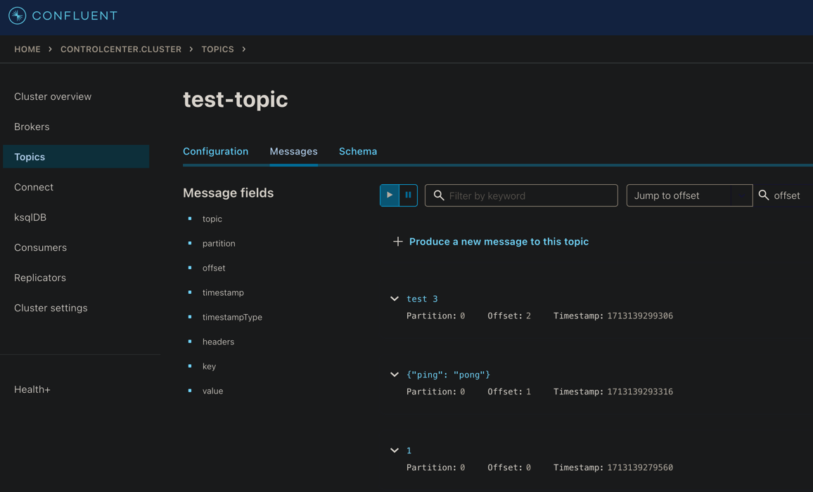

[Вернуться][main]

---

# Продюсирование событий

## Из контейнера

Переходим в контейнер

создаём топик:

```bash
kafka-topics --bootstrap-server broker1:29092 --create --topic test-topic
```

и запускаем продюсер:

```bash
kafka-console-producer --bootstrap-server broker1:29092 --topic test-topic
```

в UI можно отслеживать появление новых сообщений:



Дополнительные команды для взаимодействия через терминал:

```bash
# создать топик с кастомными партициями
kafka-topics --bootstrap-server broker1:29092 --topic <YOUR_TOPIC> --create --partitions <NUMBER>

# инфо о топике
kafka-topics --bootstrap-server broker1:29092 --describe --topic <YOUR_TOPIC> 

# список топиков
kafka-topics --bootstrap-server broker1:29092 --list

# удалить топик
kafka-topics --bootstrap-server broker1:29092 --delete --topic <YOUR_TOPIC>
```

Логи:

- `/var/log/kafka/` Директория со всеми логами.

## Извне с помощью кода на Python:

Запустим [продюсер][producer] с генерацией рандомного контента для топика `tink_backend_academy`

В консоли увидим:

```sh
Produced event to topic tink_backend_academy: key = YDEMOM       value = mortgage    
Produced event to topic tink_backend_academy: key = YDEMOM       value = credit card 
Produced event to topic tink_backend_academy: key = D324RT       value = mobile      
Produced event to topic tink_backend_academy: key = YDEMOM       value = debit card  
Produced event to topic tink_backend_academy: key = D324RT       value = debit card  
Produced event to topic tink_backend_academy: key = VS203C       value = credit card 
Produced event to topic tink_backend_academy: key = VS203C       value = insurance   
Produced event to topic tink_backend_academy: key = 9WKASC       value = credit card 
Produced event to topic tink_backend_academy: key = V4ZSKA       value = credit card 
Produced event to topic tink_backend_academy: key = V4ZSKA       value = mobile 
```


---

[Вернуться][main]


[main]: ../../README.md "содержание"

[producer]: ./src/producer.py "producer.py"

[python kafka-client]: https://docs.confluent.io/kafka-clients/python/current/overview.html "python kafka-client"